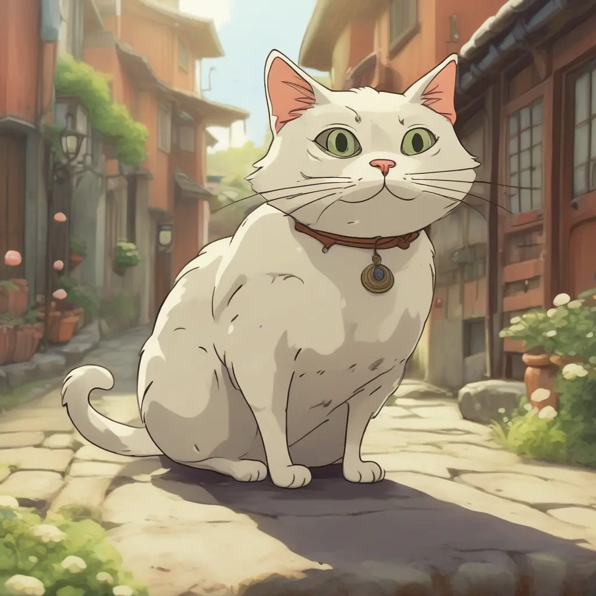

# myReplicateML

# React Image Prediction App

This is a React application that allows users to generate images based on a given prompt using the SDXL model from Replicate.
# Getting Started

# Prerequisites

Node.js (v14.0.0 or higher)
npm (v6.0.0 or higher)

# Installation

Clone the repository:

    git clone https://github.com/your-username/your-repo.git

Navigate to the project directory:

    cd your-repo

# Install dependencies:

    npm install

Create a .env.local file in the project root and add your Replicate API token:

makefile

    REPLICATE_API_TOKEN=your-api-token

    Replace your-api-token with your actual Replicate API token.

# Running the App

Run the development server:

    npm run dev

Open http://localhost:3000 in your browser.

# Usage

1. Enter a text prompt in the input field.
2. Click the "Go!" button to generate an image based on the prompt.
3. Wait for the image to be processed. The status will be displayed.

# Contributing

Feel free to contribute to this project by opening issues or submitting pull requests.
License

This project is licensed under the MIT License.

# Here's some images generated with the app:

